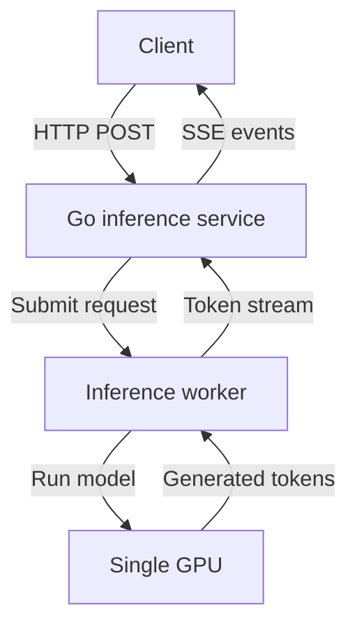

# Go Inference Service — v1 Design

## 1. Goal

Build a small Go service that accepts text-inference requests and streams generated tokens to clients. Version 1 runs on one machine with one inference worker and one GPU. Kubernetes Ingress, multiple workers, distributed queues, and global rate limiting are out of scope.

## 2. Architecture



The Go service owns the public HTTP API, validation, request IDs, admission control, timeouts, cancellation, metrics, and SSE streaming. The inference worker owns tokenization, model execution, KV-cache management, and continuous batching. The GPU performs the model computations.

## 3. API

### POST /v1/inference

Request body:

```json
{
  "model": "small-llm",
  "prompt": "Explain graph databases.",
  "max_output_tokens": 256,
  "temperature": 0.7,
  "stream": true
}
```

Rules:

- `model` and `prompt` are required and cannot be empty.
- `max_output_tokens` is optional and defaults to 256 when omitted. When present it must be between 1 and the configured limit.
- Input tokens plus `max_output_tokens` must not exceed the model context window.
- `temperature` is optional and defaults to 0. When present it must be between 0 and 2.
- `stream` is optional and defaults to `false`. A client must send `"stream": true` to receive Server-Sent Events.
- The request body cannot exceed 1 MB.
- Every response includes `X-Request-ID`; the service generates one when absent.

### GET /health

Returns 200 OK when the Go service is running. Worker and GPU readiness may be reported separately through `GET /ready`.

## 4. Streaming protocol

When `stream` is `true`, the service returns Server-Sent Events:

```
Content-Type: text/event-stream
Cache-Control: no-cache
```

`X-Accel-Buffering: no` may also be returned when deployed behind Nginx; it is not required for direct connections.

```
event: token
data: {"text":"A graph"}

event: token
data: {"text":" database"}

event: done
data: {"finish_reason":"stop","generated_tokens":42}
```

The service flushes every event immediately and preserves token order. If `stream` is `false`, it returns one JSON response after inference finishes:

```json
{"text":"A graph database","generated_tokens":42}
```

If generation fails after the stream has started, the service sends an `error` event with the same body shape as the JSON errors in section 5, then closes the connection. No `done` event follows an `error` event.

```
event: error
data: {"code":"internal_error","message":"Token not generated successfully"}
```

## 5. Errors

Before streaming starts, errors use JSON and an HTTP status code:

| Status | Code | Meaning |
|---|---|---|
| 400 | `invalid_request` | Invalid JSON or parameter values |
| 413 | `request_too_large` | Request exceeds 1 MB |
| 429 | `too_many_requests` | The caller exceeds its active-request limit |
| 503 | `capacity_exceeded` | Worker/GPU capacity is full |
| 503 | `worker_unavailable` | The inference worker is unhealthy |
| 504 | `inference_timeout` | Inference exceeded its deadline |
| 500 | `internal_error` | Unexpected server failure |

After streaming starts, the HTTP status can no longer be changed, so the service sends the `error` event described in section 4 and closes the connection. The `code` values are the same as in the table above.

## 6. Timeouts and cancellation

- Request-body read timeout: 5 seconds.
- Worker connection timeout: 2 seconds.
- Time-to-first-token timeout: 30 seconds.
- Idle time between tokens: 15 seconds.
- Maximum total inference time: 2 minutes.

The Go request context is cancelled when the client disconnects, a timeout expires, or the service shuts down. Cancellation is propagated to the worker, which must stop generation and release its KV-cache and GPU capacity.

## 7. Concurrency behavior

Version 1 uses one worker on one GPU. The worker may run several active requests together using continuous batching; it does not need to finish one entire response before advancing another. The exact active-request limit is configurable and should start conservatively, for example at two requests, until benchmarking determines safe GPU memory usage.

Requests beyond the active limit are not queued in version 1. They receive `503 Service Unavailable` with `Retry-After: 1`. A slot is released when a request completes, fails, times out, or is cancelled.

During graceful shutdown, the service rejects new requests, gives active requests up to 30 seconds to finish, and then cancels the remainder.