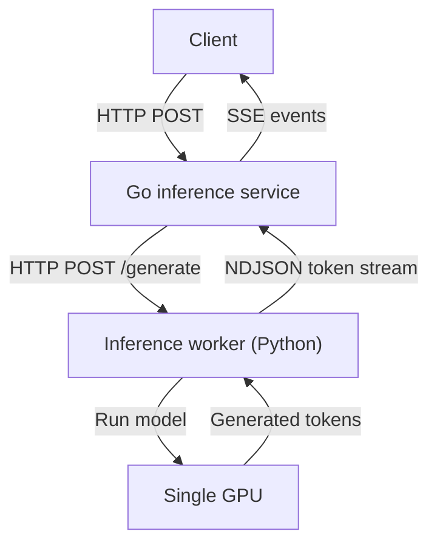

# Go Inference Service — v1 Design

## 1. Goal

Build a small Go service that accepts text-inference requests and streams generated tokens to clients. Version 1 runs on one machine with one inference worker and one GPU. Kubernetes Ingress, multiple workers, distributed queues, and global rate limiting are out of scope.

## 2. Architecture



The Go service owns the public HTTP API, validation, request IDs, admission control, timeouts, cancellation, metrics, and SSE streaming. The inference worker owns tokenization, model execution, and KV-cache management. The GPU performs the model computations.

Version 1 does not batch. Each request to the worker runs as an independent `generate` call, and the worker bounds how many run at once. Continuous batching requires an engine such as vLLM and is a candidate for version 2; see section 10 for the baseline it would be measured against.

The Go service and the worker are separate processes on the same machine and communicate over plain HTTP using the protocol in section 9. The Go side talks to the worker through a `Generator` interface, so the transport can be replaced without changing the handlers.

## 3. API

### POST /v1/inference

Request body:

```json
{
  "model": "small-llm",
  "prompt": "Explain graph databases.",
  "max_output_tokens": 256,
  "temperature": 0.7,
  "stream": true
}
```

Rules:

- `model` and `prompt` are required and cannot be empty.
- `max_output_tokens` is optional and defaults to 256 when omitted. When present it must be between 1 and the configured limit.
- Input tokens plus `max_output_tokens` must not exceed the model context window.
- `temperature` is optional and defaults to 0. When present it must be between 0 and 2.
- `stream` is optional and defaults to `false`. A client must send `"stream": true` to receive Server-Sent Events.
- The request body cannot exceed 1 MB.
- Every response includes `X-Request-ID`; the service generates one when absent.

### GET /health

Returns 200 OK when the Go service is running. Worker and GPU readiness may be reported separately through `GET /ready`.

## 4. Streaming protocol

When `stream` is `true`, the service returns Server-Sent Events:

```
Content-Type: text/event-stream
Cache-Control: no-cache
```

`X-Accel-Buffering: no` may also be returned when deployed behind Nginx; it is not required for direct connections.

```
event: token
data: {"text":"A graph"}

event: token
data: {"text":" database"}

event: done
data: {"finish_reason":"stop","generated_tokens":42}
```

The service flushes every event immediately and preserves token order. If `stream` is `false`, it returns one JSON response after inference finishes:

```json
{"text":"A graph database","generated_tokens":42}
```

If generation fails after the stream has started, the service sends an `error` event with the same body shape as the JSON errors in section 5, then closes the connection. No `done` event follows an `error` event.

```
event: error
data: {"code":"internal_error","message":"Token not generated successfully"}
```

## 5. Errors

Before streaming starts, errors use JSON and an HTTP status code:

| Status | Code | Meaning |
|---|---|---|
| 400 | `invalid_request` | Invalid JSON or parameter values |
| 413 | `request_too_large` | Request exceeds 1 MB |
| 429 | `too_many_requests` | The caller exceeds its active-request limit |
| 503 | `capacity_exceeded` | Worker/GPU capacity is full |
| 503 | `worker_unavailable` | The inference worker is unhealthy |
| 504 | `inference_timeout` | Inference exceeded its deadline |
| 500 | `internal_error` | Unexpected server failure |

After streaming starts, the HTTP status can no longer be changed, so the service sends the `error` event described in section 4 and closes the connection. The `code` values are the same as in the table above.

## 6. Timeouts and cancellation

| Timeout | Default | Enforced by |
|---|---|---|
| Request-body read | 5 seconds | `http.Server` read timeouts |
| Worker connection | 2 seconds | The worker client, inside `Generate` |
| Time to first token | 30 seconds | Timer in the handler's token loop |
| Idle time between tokens | 15 seconds | Same timer, reset after each token |
| Maximum total inference time | 2 minutes | Context deadline on the request |

The three handler-level timeouts are configurable. When any of them fires, a non-streaming request receives `504 inference_timeout` and a streaming request receives an `error` event with that code.

The Go request context is cancelled when the client disconnects, the total deadline expires, or the service shuts down. Cancellation is propagated to the worker, which must stop generation and release its KV-cache and GPU capacity. A client disconnect produces no response and no error event, since there is no one to receive it.

## 7. Concurrency behavior

Version 1 uses one worker on one GPU. The worker runs each active request as its own generation; it does not batch them. The active-request limit is configurable and should start conservatively, for example at two requests, until benchmarking determines safe GPU memory usage. The worker enforces the same limit on its side, so the two values must be kept equal.

The limit is part of the server configuration and defaults to 2. It applies only to `POST /v1/inference`; health and readiness endpoints are never capacity-limited. A slot is acquired after request validation succeeds, so invalid requests never consume capacity.

Requests beyond the active limit are not queued in version 1. They receive `503 Service Unavailable` with code `capacity_exceeded` and `Retry-After: 1`. A slot is released when a request completes, fails, times out, or is cancelled.

During graceful shutdown, the service rejects new requests, gives active requests up to 30 seconds to finish, and then cancels the remainder.

## 8. Configuration

All limits are command-line flags with the defaults below. Durations accept Go duration syntax such as `30s` or `2m`. The service refuses to start if any value is zero or negative.

| Flag | Default | Section |
|---|---|---|
| `-addr` | `:8080` | Listen address |
| `-max-active` | `2` | 7 |
| `-max-output-tokens` | `1024` | 3 |
| `-request-body-limit` | `1048576` | 3 |
| `-total-timeout` | `2m` | 6 |
| `-first-token-timeout` | `30s` | 6 |
| `-idle-timeout` | `15s` | 6 |
| `-shutdown-timeout` | `30s` | 7 |
| `-worker-url` | empty | 9. When empty, a built-in fake worker is used. |

## 9. Worker protocol

The worker is a separate HTTP process, in version 1 a Python script running `Qwen/Qwen2.5-0.5B-Instruct` through Hugging Face `transformers` with `torch`. The Go service is its only client. The protocol is deliberately simpler than the public API: no request IDs, no SSE, no versioning.

The worker loads the model before it binds its port, so until loading finishes connections are refused and the Go service reports `503 worker_unavailable`. It allows the same number of concurrent generations as the Go service's `-max-active` and answers `503` beyond that. `temperature` of 0 selects greedy decoding; any other value enables sampling at that temperature. Each request is wrapped in the model's chat template with a fixed system prompt.

### POST /generate

Request body:

```json
{
  "model": "small-llm",
  "prompt": "Explain graph databases.",
  "max_output_tokens": 256,
  "temperature": 0.7
}
```

The response is `200 OK` with `Content-Type: application/x-ndjson`. Each line is one JSON object, flushed as soon as it is produced:

```
{"text":"A graph"}
{"text":" database"}
{"done":true,"finish_reason":"stop"}
```

- A `text` line carries one generated token.
- Exactly one `done` line ends a successful stream. `finish_reason` is `stop` when the model ended generation or `length` when `max_output_tokens` was reached.
- If generation fails after the stream has started, the worker writes `{"error":"<message>"}` as the final line and closes the response. No `done` line follows.
- Any status other than 200 means the worker could not start generation. The Go service reports this to its client as `503 worker_unavailable`.

The worker must stop generating and release GPU resources when the Go service closes the connection, which happens on client disconnect, timeout, or shutdown.

### GET /health

Returns `200 OK` when the worker process is running. Because the model is loaded before the port is bound, a successful response also means the model is ready. The Go service does not currently expose a `GET /ready` endpoint; a worker that is down surfaces as `503 worker_unavailable` on the first inference request.

### Timeouts

The Go service applies the 2 second worker connection timeout from section 6 when dialing the worker. It applies no timeout to reading the response body, because the per-token and total timeouts in section 6 already bound how long a stream may run.

## 10. Baseline performance

The version 1 worker is measured before any batching engine is introduced, so that a later vLLM-backed worker can be compared against it behind the same Go service.

### Method

- Load generator: `cmd/loadgen`, a Go program that sends streaming requests through the Go service and records the arrival time of every SSE event.
- Fixed prompt, `max_output_tokens` 128, `temperature` 0 so output is deterministic.
- One warm-up request, excluded from timing.
- Concurrency levels 1, 2, 4, 8, 16, with `-max-active` and the worker's limit raised to match. 50 requests per level.
- GPU utilization sampled with `nvidia-smi` during each level.

### Metrics

| Metric | Definition |
|---|---|
| Time to first token | Request sent to first `token` event, p50 and p95 |
| Per-stream rate | Tokens per second one client sees, between its first and last `token` |
| Aggregate rate | Total tokens per second across all concurrent streams |
| Total latency | Request sent to `done` event, p50 and p95 |
| Rejections | Requests answered `503 capacity_exceeded` |

### Results

To be filled in. Record hardware, model, dtype, and git commit alongside the numbers.

| Concurrency | TTFT p50 / p95 | Per-stream tok/s | Aggregate tok/s | Latency p50 / p95 | GPU util | Rejected |
|---|---|---|---|---|---|---|
| 1 | | | | | | |
| 2 | | | | | | |
| 4 | | | | | | |
| 8 | | | | | | |
| 16 | | | | | | |