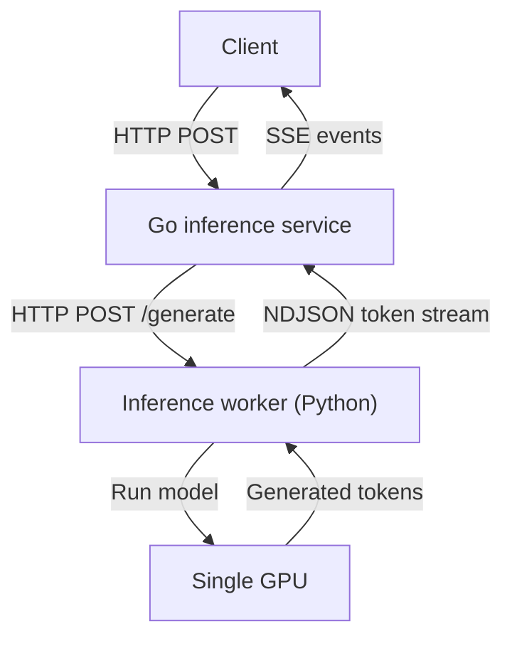
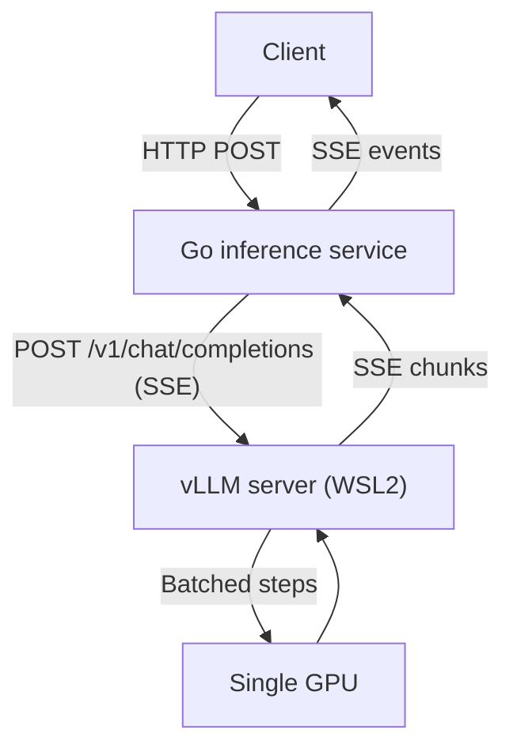

# Go Inference Service — v1 Design

## 1. Goal

Build a small Go service that accepts text-inference requests and streams generated tokens to clients. Version 1 runs on one machine with one inference worker and one GPU. Kubernetes Ingress, multiple workers, distributed queues, and global rate limiting are out of scope.

## 2. Architecture



The Go service owns the public HTTP API, validation, request IDs, admission control, timeouts, cancellation, metrics, and SSE streaming. The inference worker owns tokenization, model execution, and KV-cache management. The GPU performs the model computations.

Version 1 does not batch. Each request to the worker runs as an independent `generate` call, and the worker bounds how many run at once. Continuous batching requires an engine such as vLLM; section 10 defines the baseline it is measured against and section 11 designs the vLLM-backed worker for version 2.

The Go service and the worker are separate processes on the same machine and communicate over plain HTTP using the protocol in section 9. The Go side talks to the worker through a `Generator` interface, so the transport can be replaced without changing the handlers.

## 3. API

### POST /v1/inference

Request body:

```json
{
  "model": "small-llm",
  "prompt": "Explain graph databases.",
  "max_output_tokens": 256,
  "temperature": 0.7,
  "stream": true
}
```

Rules:

- `model` and `prompt` are required and cannot be empty.
- `max_output_tokens` is optional and defaults to 256 when omitted. When present it must be between 1 and the configured limit.
- Input tokens plus `max_output_tokens` must not exceed the model context window.
- `temperature` is optional and defaults to 0. When present it must be between 0 and 2.
- `stream` is optional and defaults to `false`. A client must send `"stream": true` to receive Server-Sent Events.
- The request body cannot exceed 1 MB.
- Every response includes `X-Request-ID`; the service generates one when absent.

### GET /health

Returns 200 OK when the Go service is running. Worker and GPU readiness may be reported separately through `GET /ready`.

## 4. Streaming protocol

When `stream` is `true`, the service returns Server-Sent Events:

```
Content-Type: text/event-stream
Cache-Control: no-cache
```

`X-Accel-Buffering: no` may also be returned when deployed behind Nginx; it is not required for direct connections.

```
event: token
data: {"text":"A graph"}

event: token
data: {"text":" database"}

event: done
data: {"finish_reason":"stop","generated_tokens":42}
```

The service flushes every event immediately and preserves token order. If `stream` is `false`, it returns one JSON response after inference finishes:

```json
{"text":"A graph database","generated_tokens":42}
```

If generation fails after the stream has started, the service sends an `error` event with the same body shape as the JSON errors in section 5, then closes the connection. No `done` event follows an `error` event.

```
event: error
data: {"code":"internal_error","message":"Token not generated successfully"}
```

## 5. Errors

Before streaming starts, errors use JSON and an HTTP status code:

| Status | Code | Meaning |
|---|---|---|
| 400 | `invalid_request` | Invalid JSON or parameter values |
| 413 | `request_too_large` | Request exceeds 1 MB |
| 429 | `too_many_requests` | The caller exceeds its active-request limit |
| 503 | `capacity_exceeded` | Worker/GPU capacity is full |
| 503 | `worker_unavailable` | The inference worker is unhealthy |
| 504 | `inference_timeout` | Inference exceeded its deadline |
| 500 | `internal_error` | Unexpected server failure |

After streaming starts, the HTTP status can no longer be changed, so the service sends the `error` event described in section 4 and closes the connection. The `code` values are the same as in the table above.

## 6. Timeouts and cancellation

| Timeout | Default | Enforced by |
|---|---|---|
| Request-body read | 5 seconds | `http.Server` read timeouts |
| Worker connection | 2 seconds | The worker client, inside `Generate` |
| Time to first token | 30 seconds | Timer in the handler's token loop |
| Idle time between tokens | 15 seconds | Same timer, reset after each token |
| Maximum total inference time | 2 minutes | Context deadline on the request |

The three handler-level timeouts are configurable. When any of them fires, a non-streaming request receives `504 inference_timeout` and a streaming request receives an `error` event with that code.

The Go request context is cancelled when the client disconnects, the total deadline expires, or the service shuts down. Cancellation is propagated to the worker, which must stop generation and release its KV-cache and GPU capacity. A client disconnect produces no response and no error event, since there is no one to receive it.

## 7. Concurrency behavior

Version 1 uses one worker on one GPU. The worker runs each active request as its own generation; it does not batch them. The active-request limit is configurable and should start conservatively, for example at two requests, until benchmarking determines safe GPU memory usage. The worker enforces the same limit on its side, so the two values must be kept equal.

Preliminary measurements (section 10) show that for the version 1 worker the limit is bounded by CPU work, not GPU memory: two concurrent generations produce less total throughput than one and double each request's latency. Each generation is a separate Python thread running its own token loop, and for a 0.5B model that loop is dominated by CPU-side work (kernel launches, sampling, streaming) rather than GPU compute, so the threads contend for the interpreter lock and interleave their kernel launches instead of overlapping useful work. The default of 2 was chosen before measuring and will be revised once the baseline table is complete; the expected outcome is a limit of 1 for this worker. Higher limits only pay off with a batching engine (section 11).

The limit is part of the server configuration and defaults to 2. It applies only to `POST /v1/inference`; health and readiness endpoints are never capacity-limited. A slot is acquired after request validation succeeds, so invalid requests never consume capacity.

Requests beyond the active limit are not queued in version 1. They receive `503 Service Unavailable` with code `capacity_exceeded` and `Retry-After: 1`. A slot is released when a request completes, fails, times out, or is cancelled.

During graceful shutdown, the service rejects new requests, gives active requests up to 30 seconds to finish, and then cancels the remainder.

## 8. Configuration

All limits are command-line flags with the defaults below. Durations accept Go duration syntax such as `30s` or `2m`. The service refuses to start if any value is zero or negative.

| Flag | Default | Section |
|---|---|---|
| `-addr` | `:8080` | Listen address |
| `-max-active` | `2` | 7 |
| `-max-output-tokens` | `1024` | 3 |
| `-request-body-limit` | `1048576` | 3 |
| `-total-timeout` | `2m` | 6 |
| `-first-token-timeout` | `30s` | 6 |
| `-idle-timeout` | `15s` | 6 |
| `-shutdown-timeout` | `30s` | 7 |
| `-worker-url` | empty | 9. When empty, a built-in fake worker is used. |
| `-worker-kind` | `http` | 11. `http` selects the version 1 worker protocol, `vllm` the OpenAI-compatible vLLM protocol. Ignored when `-worker-url` is empty. |

The worker's own limit is set with the `MAX_CONCURRENT` environment variable (default 2) and must equal `-max-active` for the version 1 worker.

## 9. Worker protocol

The worker is a separate HTTP process, in version 1 a Python script running `Qwen/Qwen2.5-0.5B-Instruct` through Hugging Face `transformers` with `torch`. The Go service is its only client. The protocol is deliberately simpler than the public API: no request IDs, no SSE, no versioning.

The worker loads the model before it binds its port, so until loading finishes connections are refused and the Go service reports `503 worker_unavailable`. It allows the same number of concurrent generations as the Go service's `-max-active` and answers `503` beyond that. `temperature` of 0 selects greedy decoding; any other value enables sampling at that temperature. Each request is wrapped in the model's chat template with a fixed system prompt.

### POST /generate

Request body:

```json
{
  "model": "small-llm",
  "prompt": "Explain graph databases.",
  "max_output_tokens": 256,
  "temperature": 0.7
}
```

The response is `200 OK` with `Content-Type: application/x-ndjson`. Each line is one JSON object, flushed as soon as it is produced:

```
{"text":"A graph"}
{"text":" database"}
{"done":true,"finish_reason":"stop","generated_tokens":42}
```

- A `text` line carries one chunk of generated text. A chunk is usually one token, but the worker's streamer withholds text until it decodes cleanly, so a chunk may cover several tokens (for example a multi-byte character). Empty chunks are not sent. Consumers must therefore not count `text` lines to obtain a token count.
- Exactly one `done` line ends a successful stream. `finish_reason` is `stop` when the model ended generation or `length` when `max_output_tokens` was reached. `generated_tokens` is the number of model tokens produced, computed by the worker from the output length minus the prompt length; the Go service passes it through to its own `done` event.
- If generation fails after the stream has started, the worker writes `{"error":"<message>"}` as the final line and closes the response. No `done` line follows.
- Any status other than 200 means the worker could not start generation. The Go service reports this to its client as `503 worker_unavailable`.

The worker must stop generating and release GPU resources when the Go service closes the connection, which happens on client disconnect, timeout, or shutdown.

### GET /health

Returns `200 OK` when the worker process is running. Because the model is loaded before the port is bound, a successful response also means the model is ready. The Go service does not currently expose a `GET /ready` endpoint; a worker that is down surfaces as `503 worker_unavailable` on the first inference request.

### Timeouts

The Go service applies the 2 second worker connection timeout from section 6 when dialing the worker. It applies no timeout to reading the response body, because the per-token and total timeouts in section 6 already bound how long a stream may run.

## 10. Baseline performance

The version 1 worker is measured before any batching engine is introduced, so that a later vLLM-backed worker can be compared against it behind the same Go service.

### Method

- Load generator: `cmd/loadgen`, a Go program that sends streaming requests through the Go service and records the arrival time of every SSE event.
- Fixed prompt, `max_output_tokens` 128, `temperature` 0 so output is deterministic. The prompt must reliably fill the token budget (every request should end with `finish_reason` `length`) so that all requests do equal work; the load generator reports the count of `length` finishes per run and a row is only valid when it equals the request count.
- Token counts come from `generated_tokens` in the `done` event, not from counting `token` events, because one event can carry more than one token (section 9).
- One warm-up request, excluded from timing.
- Concurrency levels 1, 2, 4, 8, 16, with `-max-active` and the worker's limit raised to match. 50 requests per level. A row is only valid with zero rejections and zero failures.
- GPU utilization and SM clock sampled with `nvidia-smi` during each level. A clock well below the maximum indicates thermal or power throttling and invalidates the row.
- The machine is on mains power with the same power plan for every level; the power mode is recorded with the hardware. Laptop GPUs run at lower clocks on battery, which changes single-stream throughput by up to 2×.
- The load generator also writes one line per request (start offset, TTFT, latency, tokens, finish reason) so latency can be examined against start time. A spread between p50 and p95 latency for equal work needs explaining before the row is recorded: latency that drifts upward over the run indicates throttling; a bimodal distribution with no trend indicates unfair scheduling between concurrent generations.
- Before each level, the expected direction of aggregate throughput and p95 latency is written down; the comparison with the measured values is part of the result.

### Metrics

| Metric | Definition |
|---|---|
| Time to first token | Request sent to first `token` event, p50 and p95 |
| Per-stream rate | Tokens per second one client sees, between its first and last `token` |
| Aggregate rate | Total tokens per second across all concurrent streams |
| Total latency | Request sent to `done` event, p50 and p95 |
| Rejections | Requests answered `503 capacity_exceeded` |

### Preliminary results

Measured 2026-09-25 on an NVIDIA GeForce RTX 4050 Laptop GPU (6 GB), Qwen2.5-0.5B-Instruct in bf16, commit `ef8b966`, before the `generated_tokens` change. Rates are therefore in SSE events per second, which undercounts tokens (128 tokens in 2.73 s is 47 tokens/s, reported as 37). Power mode was not recorded. These rows are superseded by the final table but are kept because they established the finding in section 7.

| Concurrency | TTFT p50 / p95 | Per-stream events/s | Aggregate events/s | Latency p50 / p95 | Rejected |
|---|---|---|---|---|---|
| 1 | 52 ms / 58 ms | 37.3 | 36.8 | 2.73 s / 2.87 s | 0 |
| 2 | 92 ms / 229 ms | 19.5 | 29.0 | 5.22 s / 14.46 s | 0 |

Observations:

- At concurrency 1, p50 and p95 latency are within 5%, as expected for identical work; the machine did not slow down over the run.
- At concurrency 2, aggregate throughput fell by 21% and p50 latency doubled. Total throughput is lower than serving the same requests one after another.
- At concurrency 2, p95 latency is 2.8× p50 for identical work. Aggregate (29.0) is well below 2 × per-stream (39.0), so for a large part of the run only one generation was making progress. Both point to unfair interleaving of the two generation threads; the per-request log described in the method is needed to confirm.

### Results

To be filled in with the final method above. Record hardware, model, dtype, power mode, and git commit alongside the numbers.

| Concurrency | TTFT p50 / p95 | Per-stream tok/s | Aggregate tok/s | Latency p50 / p95 | GPU util | Rejected |
|---|---|---|---|---|---|---|
| 1 | | | | | | |
| 2 | | | | | | |
| 4 | | | | | | |
| 8 | | | | | | |
| 16 | | | | | | |

## 11. Version 2: vLLM-backed worker

### Motivation

The version 1 worker runs one Python thread per request, each with its own token loop. Section 7 explains why adding requests reduces throughput: the per-token cost is CPU-side, and threads cannot share the interpreter. A batching engine runs one loop for all active requests. Each step performs a single forward pass over the whole batch, so the CPU cost per step stays roughly constant while the GPU, which has spare capacity for a 0.5B model, processes more rows. Requests can join and leave the batch between steps (continuous batching), and the KV cache is allocated in fixed-size blocks (PagedAttention) so many concurrent requests fit in 6 GB without reserving the worst case for each.

vLLM is chosen because it runs with a single `pip install`, exposes an OpenAI-compatible HTTP API with SSE streaming, and is the common reference point for comparisons. It runs on Linux only; on the development machine it runs under WSL2, which shares the Windows NVIDIA driver.

Expected outcome, to be tested against the baseline: aggregate throughput rises with concurrency instead of falling, single-stream throughput improves because vLLM uses CUDA graphs and fused kernels to cut launch overhead, and per-stream rate under load declines gently as batch size grows. TTFT under load may rise because a new request waits for the current step to finish before joining the batch.

### Architecture

Nothing changes for clients, and nothing changes in `internal/api`. The handlers depend only on the `Generator` interface:

```go
type Generator interface {
    Generate(ctx context.Context, req Request) (<-chan Token, error)
}
```

A second implementation, `VLLMClient` in `internal/worker`, speaks vLLM's protocol and produces the same `Token` stream. `cmd/server` selects it with `-worker-kind vllm`. The Python worker from version 1 is kept; both workers are benchmarked behind the same Go service with the same load generator.



### Worker protocol (vLLM)

The Go service is the only client. The request maps the fields of `worker.Request` onto vLLM's chat completions body. The chat endpoint is used rather than `/v1/completions` so that vLLM applies the model's chat template and the same fixed system prompt as the version 1 worker; otherwise outputs would not be comparable.

```json
{
  "model": "Qwen/Qwen2.5-0.5B-Instruct",
  "messages": [
    {"role": "system", "content": "<same system prompt as version 1>"},
    {"role": "user", "content": "Explain graph databases."}
  ],
  "max_tokens": 256,
  "temperature": 0.7,
  "stream": true,
  "stream_options": {"include_usage": true}
}
```

The response is `200 OK` with `Content-Type: text/event-stream`. Each event is a `data:` line followed by a blank line; the stream ends with `data: [DONE]`:

```
data: {"choices":[{"delta":{"role":"assistant","content":""},"finish_reason":null}]}

data: {"choices":[{"delta":{"content":"A graph"},"finish_reason":null}]}

data: {"choices":[{"delta":{"content":" database"},"finish_reason":null}]}

data: {"choices":[{"delta":{},"finish_reason":"stop"}]}

data: {"choices":[],"usage":{"prompt_tokens":31,"completion_tokens":42}}

data: [DONE]
```

Mapping rules in `VLLMClient`:

| vLLM | `Token` |
|---|---|
| `choices[0].delta.content` non-empty | `Token{Text: content}` |
| `choices[0].delta.content` empty (first chunk carries only the role) | skipped |
| `choices[0].finish_reason` set (`stop` or `length`) | remembered; emitted as `Token{FinishReason: ...}` once the stream ends |
| final chunk with `usage` and empty `choices` | `usage.completion_tokens` becomes `generated_tokens` |
| `data: [DONE]` | end of stream; close the channel |
| blank line | skipped |
| connection drops before `[DONE]` | `Token{Err: ...}` from `scanner.Err()`, unless the context was cancelled |
| non-200 status before streaming | `Generate` returns an error; the handler reports `503 worker_unavailable` |

There is no mid-stream error line in this protocol; vLLM reports failures with a non-200 status before streaming or by closing the connection.

Cancellation uses the same mechanism as version 1: the request is created with the handler's context, so a client disconnect, timeout, or shutdown closes the connection to vLLM, and vLLM aborts the request and frees its KV-cache blocks.

### Capacity

vLLM does not reject requests when busy; it queues them and admits them into the batch as blocks free up. Consequently the worker-side limit from section 7 does not exist for this worker, and `-max-active` on the Go service is the only admission control. Its meaning shifts from "matches the worker's slot count" to "the largest batch this deployment is willing to run". `503 capacity_exceeded` is still returned above the limit, so client behaviour is unchanged. The value is set from the version 2 benchmark: the highest concurrency at which p95 latency stays within the target, rather than 1 as expected for version 1.

vLLM's own memory budget is set with `--gpu-memory-utilization`; with the model taking about 1 GB of the 6 GB, most of the rest becomes KV-cache blocks. `--max-num-seqs` caps the batch size inside vLLM and should be set at or above `-max-active` so that the Go limit is the one that binds.

### Running

```
python -m vllm.entrypoints.openai.api_server --model Qwen/Qwen2.5-0.5B-Instruct --dtype bfloat16 --port 8001
```

inside WSL2, then `go run ./cmd/server -worker-url http://localhost:8001 -worker-kind vllm -max-active 16`. Ports bound inside WSL2 are reachable from Windows on `localhost`.

### Comparison

The load generator, prompt, token budget, and levels from section 10 are reused unchanged. Results go in a second table with the same columns, and the two tables are compared row by row on aggregate throughput, per-stream rate, TTFT p95, and latency p95. The comparison is only valid if hardware, dtype, and power mode match the baseline.

### Out of scope for version 2

Quantization, tensor parallelism, speculative decoding, prefix caching across requests, and replacing the Go service's own SSE layer with vLLM's. These change the workload or the architecture rather than the batching strategy being measured.