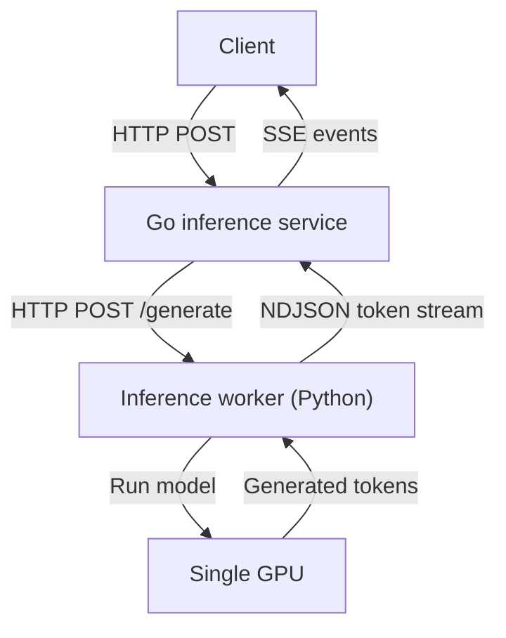
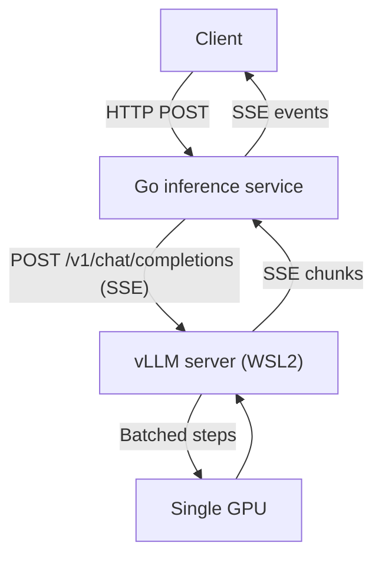

# Go Inference Service — v1 Design

## 1. Goal

Build a small Go service that accepts text-inference requests and streams generated tokens to clients. Version 1 runs on one machine with one inference worker and one GPU. Kubernetes Ingress, multiple workers, distributed queues, and global rate limiting are out of scope.

## 2. Architecture


```mermaid
flowchart TD
    C["Client"] -->|"HTTP POST"| G["Go inference service"]
    G -->|"HTTP POST /generate"| W["Inference worker (Python)"]
    W -->|"Run model"| GPU["Single GPU"]
    GPU -->|"Generated tokens"| W
    W -->|"NDJSON token stream"| G
    G -->|"SSE events"| C
```

The Go service owns the public HTTP API, validation, request IDs, admission control, timeouts, cancellation, metrics, and SSE streaming. The inference worker owns tokenization, model execution, and KV-cache management. The GPU performs the model computations.

Version 1 does not batch. Each request to the worker runs as an independent `generate` call, and the worker bounds how many run at once. Continuous batching requires an engine such as vLLM; section 10 defines the baseline it is measured against and section 11 designs the vLLM-backed worker for version 2.

The Go service and the worker are separate processes on the same machine and communicate over plain HTTP using the protocol in section 9. The Go side talks to the worker through a `Generator` interface, so the transport can be replaced without changing the handlers; section 11 uses that to swap in vLLM. An optional Nginx edge proxy (section 12) sits in front of the Go service for TLS and per-client limits.

## 3. API

### POST /v1/inference

Request body:

```json
{
  "model": "small-llm",
  "prompt": "Explain graph databases.",
  "max_output_tokens": 256,
  "temperature": 0.7,
  "stream": true
}
```

Rules:

- `model` and `prompt` are required and cannot be empty.
- `max_output_tokens` is optional and defaults to 256 when omitted. When present it must be between 1 and the configured limit.
- Input tokens plus `max_output_tokens` must not exceed the model context window.
- `temperature` is optional and defaults to 0. When present it must be between 0 and 2.
- `stream` is optional and defaults to `false`. A client must send `"stream": true` to receive Server-Sent Events.
- The request body cannot exceed 1 MB.
- Every response includes `X-Request-ID`; the service generates one when absent.

### GET /health

Returns 200 OK when the Go service is running. Worker and GPU readiness may be reported separately through `GET /ready`.

## 4. Streaming protocol

When `stream` is `true`, the service returns Server-Sent Events:

```
Content-Type: text/event-stream
Cache-Control: no-cache
```

`X-Accel-Buffering: no` may also be returned when deployed behind Nginx; it is not required for direct connections. Section 12 covers the proxy configuration and why buffering must be off for this endpoint.

```
event: token
data: {"text":"A graph"}

event: token
data: {"text":" database"}

event: done
data: {"finish_reason":"stop","generated_tokens":42}
```

The service flushes every event immediately and preserves token order. If `stream` is `false`, it returns one JSON response after inference finishes:

```json
{"text":"A graph database","generated_tokens":42}
```

If generation fails after the stream has started, the service sends an `error` event with the same body shape as the JSON errors in section 5, then closes the connection. No `done` event follows an `error` event.

```
event: error
data: {"code":"internal_error","message":"Token not generated successfully"}
```

## 5. Errors

Before streaming starts, errors use JSON and an HTTP status code:

| Status | Code | Meaning |
|---|---|---|
| 400 | `invalid_request` | Invalid JSON or parameter values |
| 413 | `request_too_large` | Request exceeds 1 MB |
| 429 | `too_many_requests` | The caller exceeds its per-client rate limit. Enforced at the edge proxy (section 12); the Go service does not implement per-client limits itself |
| 503 | `capacity_exceeded` | Worker/GPU capacity is full |
| 503 | `worker_unavailable` | The inference worker is unhealthy |
| 504 | `inference_timeout` | Inference exceeded its deadline |
| 500 | `internal_error` | Unexpected server failure |

After streaming starts, the HTTP status can no longer be changed, so the service sends the `error` event described in section 4 and closes the connection. The `code` values are the same as in the table above.

## 6. Timeouts and cancellation

| Timeout | Default | Enforced by |
|---|---|---|
| Request-body read | 5 seconds | `http.Server` read timeouts |
| Worker connection | 2 seconds | The worker client, inside `Generate` |
| Time to first token | 30 seconds | Timer in the handler's token loop |
| Idle time between tokens | 15 seconds | Same timer, reset after each token |
| Maximum total inference time | 2 minutes | Context deadline on the request |

The three handler-level timeouts are configurable. When any of them fires, a non-streaming request receives `504 inference_timeout` and a streaming request receives an `error` event with that code.

The Go request context is cancelled when the client disconnects, the total deadline expires, or the service shuts down. Cancellation is propagated to the worker, which must stop generation and release its KV-cache and GPU capacity. A client disconnect produces no response and no error event, since there is no one to receive it.

## 7. Concurrency behavior

Version 1 uses one worker on one GPU. The worker runs each active request as its own generation; it does not batch them. The active-request limit is configurable and should start conservatively, for example at two requests, until benchmarking determines safe GPU memory usage. The worker enforces the same limit on its side, so the two values must be kept equal.

The baseline measurements (section 10) show that for the version 1 worker the limit is bounded by CPU work, not GPU memory. Aggregate throughput is flat at 40–49 tokens/s from 1 to 4 concurrent requests while per-request latency grows linearly (2.85 s, 5.4 s, 10.2 s), and GPU utilization stays at 43–45% at every level. Each generation is a separate Python thread running its own token loop, and for a 0.5B model each token step is dominated by CPU-side work (about 300 kernel launches from Python, sampling, the stopping criteria, streaming) rather than GPU compute. The threads contend for the interpreter lock, so adding requests divides a fixed amount of work rather than adding capacity, and the GPU cannot be fed any faster. The correct `MAX_CONCURRENT` for this worker is therefore 1: higher values give no throughput and cost every client latency. Higher limits only pay off with a batching engine (section 11), where one loop serves every active request.

The limit is part of the server configuration and defaults to 2, a value chosen before measuring; for the version 1 worker it should be run at 1. It applies only to `POST /v1/inference`; health and readiness endpoints are never capacity-limited. A slot is acquired after request validation succeeds, so invalid requests never consume capacity.

Requests beyond the active limit are not queued in version 1. They receive `503 Service Unavailable` with code `capacity_exceeded` and `Retry-After: 1`. A slot is released when a request completes, fails, times out, or is cancelled.

During graceful shutdown, the service rejects new requests, gives active requests up to 30 seconds to finish, and then cancels the remainder.

## 8. Configuration

All limits are command-line flags with the defaults below. Durations accept Go duration syntax such as `30s` or `2m`. The service refuses to start if any value is zero or negative.

| Flag | Default | Section |
|---|---|---|
| `-addr` | `:8080` | Listen address |
| `-max-active` | `2` | 7 |
| `-max-output-tokens` | `1024` | 3 |
| `-request-body-limit` | `1048576` | 3 |
| `-total-timeout` | `2m` | 6 |
| `-first-token-timeout` | `30s` | 6 |
| `-idle-timeout` | `15s` | 6 |
| `-shutdown-timeout` | `30s` | 7 |
| `-worker-url` | empty | 9. When empty, a built-in fake worker is used. |
| `-worker-kind` | `http` | 11. `http` selects the version 1 worker protocol, `vllm` the OpenAI-compatible vLLM protocol. Ignored when `-worker-url` is empty. |
| `-worker-model` | `Qwen/Qwen2.5-0.5B-Instruct` | 11. Model name sent to a vLLM worker; must match what vLLM serves or vLLM answers 404. Ignored for other worker kinds. |

The worker's own limit is set with the `MAX_CONCURRENT` environment variable (default 2) and must equal `-max-active` for the version 1 worker. With the vLLM worker, `-max-active` is the only admission control (section 11) and should be set from the version 2 results; 64 is the recommended default on the benchmark hardware. Behind the edge proxy (section 12) the service should listen on `127.0.0.1:8080` so that it is reachable only through the proxy.

## 9. Worker protocol

The worker is a separate HTTP process, in version 1 a Python script running `Qwen/Qwen2.5-0.5B-Instruct` through Hugging Face `transformers` with `torch`. The Go service is its only client. The protocol is deliberately simpler than the public API: no request IDs, no SSE, no versioning.

The worker loads the model before it binds its port, so until loading finishes connections are refused and the Go service reports `503 worker_unavailable`. It allows the same number of concurrent generations as the Go service's `-max-active` and answers `503` beyond that. `temperature` of 0 selects greedy decoding; any other value enables sampling at that temperature. Each request is wrapped in the model's chat template with a fixed system prompt.

### POST /generate

Request body:

```json
{
  "model": "small-llm",
  "prompt": "Explain graph databases.",
  "max_output_tokens": 256,
  "temperature": 0.7
}
```

The response is `200 OK` with `Content-Type: application/x-ndjson`. Each line is one JSON object, flushed as soon as it is produced:

```
{"text":"A graph"}
{"text":" database"}
{"done":true,"finish_reason":"stop","generated_tokens":42}
```

- A `text` line carries one chunk of generated text. A chunk is usually one token, but the worker's streamer withholds text until it decodes cleanly, so a chunk may cover several tokens (for example a multi-byte character). Empty chunks are not sent. Consumers must therefore not count `text` lines to obtain a token count.
- Exactly one `done` line ends a successful stream. `finish_reason` is `stop` when the model ended generation or `length` when `max_output_tokens` was reached. `generated_tokens` is the number of model tokens produced, computed by the worker from the output length minus the prompt length; the Go service passes it through to its own `done` event.
- If generation fails after the stream has started, the worker writes `{"error":"<message>"}` as the final line and closes the response. No `done` line follows.
- Any status other than 200 means the worker could not start generation. The Go service reports this to its client as `503 worker_unavailable`.

The worker must stop generating and release GPU resources when the Go service closes the connection, which happens on client disconnect, timeout, or shutdown.

### GET /health

Returns `200 OK` when the worker process is running. Because the model is loaded before the port is bound, a successful response also means the model is ready. The Go service does not currently expose a `GET /ready` endpoint; a worker that is down surfaces as `503 worker_unavailable` on the first inference request.

### Timeouts

The Go service applies the 2 second worker connection timeout from section 6 when dialing the worker. It applies no timeout to reading the response body, because the per-token and total timeouts in section 6 already bound how long a stream may run.

## 10. Baseline performance

The version 1 worker is measured before any batching engine is introduced, so that a later vLLM-backed worker can be compared against it behind the same Go service.

### Method

- Load generator: `cmd/loadgen`, a Go program that sends streaming requests through the Go service and records the arrival time of every SSE event.
- Fixed prompt, `max_output_tokens` 128, `temperature` 0 so output is deterministic. The prompt must reliably fill the token budget (every request should end with `finish_reason` `length`) so that all requests do equal work; the load generator reports the count of `length` finishes per run and a row is only valid when it equals the request count.
- Token counts come from `generated_tokens` in the `done` event, not from counting `token` events, because one event can carry more than one token (section 9).
- One warm-up request, excluded from timing.
- Concurrency levels 1, 2, 4, 8, 16, with `-max-active` and the worker's limit raised to match. 50 requests per level. A row is only valid with zero rejections and zero failures.
- GPU utilization and SM clock sampled with `nvidia-smi` during each level. A clock well below the maximum indicates thermal or power throttling and invalidates the row.
- The machine is on mains power with the same power plan for every level; the power mode is recorded with the hardware. Laptop GPUs run at lower clocks on battery, which changes single-stream throughput by up to 2×.
- The load generator also writes one line per request (start offset, TTFT, latency, tokens, finish reason) so latency can be examined against start time. A spread between p50 and p95 latency for equal work needs explaining before the row is recorded: latency that drifts upward over the run indicates throttling; a bimodal distribution with no trend indicates unfair scheduling between concurrent generations.
- Before each level, the expected direction of aggregate throughput and p95 latency is written down; the comparison with the measured values is part of the result.

### Metrics

| Metric | Definition |
|---|---|
| Time to first token | Request sent to first `token` event, p50 and p95 |
| Per-stream rate | Tokens per second one client sees, between its first and last `token` |
| Aggregate rate | Total tokens per second across all concurrent streams |
| Total latency | Request sent to `done` event, p50 and p95 |
| Rejections | Requests answered `503 capacity_exceeded` |

### Preliminary results

Measured 2026-09-25 on an NVIDIA GeForce RTX 4050 Laptop GPU (6 GB), Qwen2.5-0.5B-Instruct in bf16, commit `ef8b966`, before the `generated_tokens` change. Rates are therefore in SSE events per second, which undercounts tokens (128 tokens in 2.73 s is 47 tokens/s, reported as 37). Power mode was not recorded. These rows are superseded by the final table but are kept because they established the finding in section 7.

| Concurrency | TTFT p50 / p95 | Per-stream events/s | Aggregate events/s | Latency p50 / p95 | Rejected |
|---|---|---|---|---|---|
| 1 | 52 ms / 58 ms | 37.3 | 36.8 | 2.73 s / 2.87 s | 0 |
| 2 | 92 ms / 229 ms | 19.5 | 29.0 | 5.22 s / 14.46 s | 0 |

Observations:

- At concurrency 1, p50 and p95 latency are within 5%, as expected for identical work; the machine did not slow down over the run.
- At concurrency 2, aggregate throughput fell by 21% and p50 latency doubled. Total throughput is lower than serving the same requests one after another.
- At concurrency 2, p95 latency is 2.8× p50 for identical work. Aggregate (29.0) is well below 2 × per-stream (39.0), so for a large part of the run only one generation was making progress. Both point to unfair interleaving of the two generation threads; the per-request log described in the method is needed to confirm.

### Results

Measured 2026-09-25 on an NVIDIA GeForce RTX 4050 Laptop GPU (6 GB VRAM, SM clock 2565 MHz sustained, 51–63 °C), Qwen2.5-0.5B-Instruct in bf16, worker commit `51ea62e`, mains power. Token counts from `generated_tokens`; every request generated exactly 128 tokens (`length` 50/50 at each level). Warm-up was disabled for these runs. Raw per-request data and GPU logs are in `bench/v1/`.

| Concurrency | TTFT p50 / p95 | Per-stream tok/s | Aggregate tok/s | Latency p50 / p95 | GPU util (active) | Rejected |
|---|---|---|---|---|---|---|
| 1 | 51 ms / 195 ms | 45.3 | 40.2 | 2.85 s / 4.11 s | ~43% | 0 |
| 2 | 95 ms / 115 ms | 23.8 | 46.2 | 5.43 s / 6.19 s | ~44% | 0 |
| 4 | 180 ms / 798 ms | 12.6 | 49.0 | 10.24 s / 11.66 s | ~45% | 0 |

Levels 8 and 16 were not run: three points already show the shape (flat throughput, linear latency), and higher levels would only lengthen latency further.

Observations:

- Aggregate throughput is flat. Four concurrent requests deliver 49 tok/s against 40 for one, a 22% gain that comes from filling the idle gaps a single stream leaves (HTTP round trips, the Go-to-worker handoff, the GPU idling between requests), not from the GPU doing more. Per-request latency grows in proportion to concurrency: each user gets a 1/N share of a fixed capacity.
- GPU utilization does not move with load. It is 43–45% at every level. A GPU-bound worker would climb toward 100% as requests are added; this one cannot be fed faster, which identifies the per-request CPU loop as the limit (section 7).
- The level 1 p95 values are inflated by a cluster of slow requests at the start of the run: the five slowest requests all began in the first 36 s (9.8 s, 7.7 s, 5.8 s, 4.1 s, 3.4 s), after which all 45 remaining requests took 2.7–3.0 s. Quarter medians are flat (2914, 2840, 2804, 2894 ms), so this is start-up cost with no warm-up, not drift. Steady-state p95 is about 3.0 s.
- The 2.8× p50-to-p95 latency spread seen in the preliminary run at concurrency 2 did not reproduce (5.43 s vs 6.19 s here), so the earlier observation of unfair thread interleaving is withdrawn; the single-stream number (37 events/s vs 45 tok/s here) also confirms that the preliminary rates undercounted by counting events.
- The preliminary conclusion that concurrency 2 is *worse* than 1 was too strong; the corrected finding is that concurrency gives no meaningful gain for this worker while doubling latency. The recommendation (`MAX_CONCURRENT` = 1) is unchanged.

## 11. Version 2: vLLM-backed worker

### Motivation

The version 1 worker runs one Python thread per request, each with its own token loop. Section 7 explains why adding requests reduces throughput: the per-token cost is CPU-side, and threads cannot share the interpreter. A batching engine runs one loop for all active requests. Each step performs a single forward pass over the whole batch, so the CPU cost per step stays roughly constant while the GPU, which has spare capacity for a 0.5B model, processes more rows. Requests can join and leave the batch between steps (continuous batching), and the KV cache is allocated in fixed-size blocks (PagedAttention) so many concurrent requests fit in 6 GB without reserving the worst case for each.

vLLM is chosen because it runs with a single `pip install`, exposes an OpenAI-compatible HTTP API with SSE streaming, and is the common reference point for comparisons. It runs on Linux only; on the development machine it runs under WSL2, which shares the Windows NVIDIA driver.

Expected outcome, written before measuring: aggregate throughput rises with concurrency instead of staying flat, single-stream throughput improves because vLLM uses CUDA graphs and fused kernels to cut launch overhead, and per-stream rate under load declines gently as batch size grows. TTFT under load may rise because a new request waits for the current step to finish before joining the batch. All four were confirmed; see Results below.

### Architecture

Nothing changes for clients, and nothing changes in `internal/api`. The handlers depend only on the `Generator` interface:

```go
type Generator interface {
    Generate(ctx context.Context, req Request) (<-chan Token, error)
}
```

A second implementation, `VLLMClient` in `internal/worker`, speaks vLLM's protocol and produces the same `Token` stream. `cmd/server` selects it with `-worker-kind vllm`. The Python worker from version 1 is kept; both workers are benchmarked behind the same Go service with the same load generator.


```mermaid
flowchart TD
    C["Client"] -->|"HTTP POST"| G["Go inference service"]
    G -->|"POST /v1/chat/completions (SSE)"| V["vLLM server (WSL2)"]
    V -->|"Batched steps"| GPU["Single GPU"]
    GPU --> V
    V -->|"SSE chunks"| G
    G -->|"SSE events"| C
```

### Worker protocol (vLLM)

The Go service is the only client. The request maps the fields of `worker.Request` onto vLLM's chat completions body. The chat endpoint is used rather than `/v1/completions` so that vLLM applies the model's chat template and the same fixed system prompt as the version 1 worker; otherwise outputs would not be comparable.

```json
{
  "model": "Qwen/Qwen2.5-0.5B-Instruct",
  "messages": [
    {"role": "system", "content": "<same system prompt as version 1>"},
    {"role": "user", "content": "Explain graph databases."}
  ],
  "max_tokens": 256,
  "temperature": 0.7,
  "stream": true,
  "stream_options": {"include_usage": true}
}
```

The response is `200 OK` with `Content-Type: text/event-stream`. Each event is a `data:` line followed by a blank line; the stream ends with `data: [DONE]`:

```
data: {"choices":[{"delta":{"role":"assistant","content":""},"finish_reason":null}]}

data: {"choices":[{"delta":{"content":"A graph"},"finish_reason":null}]}

data: {"choices":[{"delta":{"content":" database"},"finish_reason":null}]}

data: {"choices":[{"delta":{},"finish_reason":"stop"}]}

data: {"choices":[],"usage":{"prompt_tokens":31,"completion_tokens":42}}

data: [DONE]
```

Mapping rules in `VLLMClient`:

| vLLM | `Token` |
|---|---|
| `choices[0].delta.content` non-empty | `Token{Text: content}` |
| `choices[0].delta.content` empty (first chunk carries only the role) | skipped |
| `choices[0].finish_reason` set (`stop` or `length`) | remembered; emitted as `Token{FinishReason: ...}` once the stream ends |
| final chunk with `usage` and empty `choices` | `usage.completion_tokens` becomes `generated_tokens` |
| `data: [DONE]` | end of stream; close the channel |
| blank line | skipped |
| connection drops before `[DONE]` | `Token{Err: ...}` from `scanner.Err()`, unless the context was cancelled |
| non-200 status before streaming | `Generate` returns an error; the handler reports `503 worker_unavailable` |

There is no mid-stream error line in this protocol; vLLM reports failures with a non-200 status before streaming or by closing the connection.

Cancellation uses the same mechanism as version 1: the request is created with the handler's context, so a client disconnect, timeout, or shutdown closes the connection to vLLM, and vLLM aborts the request and frees its KV-cache blocks.

### Capacity

vLLM does not reject requests when busy; it queues them and admits them into the batch as blocks free up. Consequently the worker-side limit from section 7 does not exist for this worker, and `-max-active` on the Go service is the only admission control. Its meaning shifts from "matches the worker's slot count" to "the largest batch this deployment is willing to run". `503 capacity_exceeded` is still returned above the limit, so client behaviour is unchanged. The value is set from the version 2 benchmark: the highest concurrency at which latency stays within the target. On the benchmark hardware the recommended default is **64**: it delivers 5.5k tok/s (40× the version 1 ceiling) while keeping p50 latency under 1.5 s and per-stream speed above 90 tok/s for 128-token responses. Deployments that prioritise throughput over latency can raise it; the curve continues to 8.3k tok/s at 128 with p50 latency under 2 s. These numbers hold for the benchmark prompt shape (about 40 prompt tokens, 128 output tokens); longer prompts make prefill more expensive and move the knee to lower concurrency.

vLLM's own memory budget is set with `--gpu-memory-utilization`. The fraction is of total VRAM, and on a 6 GB laptop GPU the default 0.9 fails at startup because Windows holds several hundred MB itself; 0.7 (about 4.3 GB: ~1 GB weights, the rest KV-cache blocks) starts reliably and is far more cache than this workload uses (a 170-token request needs about 2 MB of blocks). `--max-num-seqs` caps the batch size inside vLLM and should be set at or above `-max-active` so that the Go limit is the one that binds.

### Running

Inside WSL2 (Ubuntu 22.04 or newer; Python 3.9+), in a dedicated virtual environment:

```
VLLM_USE_FLASHINFER_SAMPLER=0 vllm serve Qwen/Qwen2.5-0.5B-Instruct --dtype bfloat16 --port 8001 --max-model-len 2048 --max-num-seqs 128 --gpu-memory-utilization 0.7
```

then `go run ./cmd/server -worker-url http://localhost:8001 -worker-kind vllm -max-active 64`. Ports bound inside WSL2 are reachable from Windows on `localhost`.

`VLLM_USE_FLASHINFER_SAMPLER=0` is required on a WSL install without the CUDA toolkit: vLLM's FlashInfer sampler compiles a kernel just-in-time on first use and fails with `Could not find nvcc` when it cannot. The PyTorch-native sampler it falls back to is equivalent at temperature 0 (argmax) and only slower for top-k/top-p sampling. The attention backend on this GPU is FlashAttention, shipped precompiled, so no other component needs the toolkit.

### Comparison

The load generator, prompt, token budget, and levels from section 10 are reused unchanged, with additional levels of 32, 64 and 128 to find the knee, using four waves of requests per level (`-requests` = 4 × concurrency) and one warm-up request. The two tables are compared row by row on aggregate throughput, per-stream rate, TTFT, and latency. The comparison is only valid if hardware, dtype, and power mode match the baseline.

### Results

Measured 2026-09-26 on the same hardware as section 10 (RTX 4050 Laptop, 6 GB, 2565 MHz sustained, peak 66 °C), Qwen2.5-0.5B-Instruct in bf16, vLLM with the flags above, Go commit `ab8b3e9`. Every request generated exactly 128 tokens at every level, with zero rejections and zero failures. Levels 1–16 were run without warm-up and 50 requests each (`bench/v2/`); levels 32–128 with one warm-up and four waves (`bench/v3/`).

| Concurrency | TTFT p50 / p95 | Per-stream tok/s | Aggregate tok/s | Step time | Latency p50 / p95 | GPU util (active) |
|---|---|---|---|---|---|---|
| 1 | 16 ms / 20 ms | 131.5 | 129 | 7.8 ms | 0.98 s / 1.03 s | ~82% |
| 2 | 24 ms / 33 ms | 133.9 | 259 | 7.7 ms | 0.98 s / 1.02 s | ~82% |
| 4 | 30 ms / 324 ms | 131.6 | 483 | 8.3 ms | 1.00 s / 1.31 s | ~84% |
| 16 | 47 ms / 433 ms | 125.2 | 1,413 | 11.3 ms* | 1.06 s / 1.46 s | ~79% |
| 32 | 61 ms / 115 ms | 109.6 | 3,344 | 9.6 ms | 1.20 s / 1.29 s | ~76% |
| 64 | 69 ms / 190 ms | 91.7 | 5,487 | 11.7 ms | 1.48 s / 1.58 s | ~84% |
| 128 | 83 ms / 335 ms | 68.0 | 8,305 | 15.4 ms | 1.96 s / 2.20 s | ~86% |

Step time is the wall time of one decode step, derived as concurrency ÷ aggregate rate. *The level 16 row was run without warm-up and its step time and p95 values include the cold first wave; the level 32 row, run with warm-up, is the cleaner reference for that region.

Against the baseline:

| Concurrency | v1 aggregate | v2 aggregate | Ratio | v1 latency p50 | v2 latency p50 |
|---|---|---|---|---|---|
| 1 | 40 | 129 | 3.2× | 2.85 s | 0.98 s |
| 4 | 49 | 483 | 9.9× | 10.24 s | 1.00 s |
| 64 | ~49 (ceiling) | 5,487 | ~110× | — | 1.48 s |

Observations:

- **Single-stream speed improved 2.9× with no batching involved** (45 → 131 tok/s). This is the per-step CPU cost falling: CUDA graphs replace the ~300 per-token kernel launches with one replay, kernels are fused, and the scheduler does far less Python work per step. GPU utilization for one request rose from 43% to ~82%; the GPU work itself did not shrink much, the waiting around it did.
- **Throughput scales almost linearly to 32 concurrent requests at nearly constant per-user speed.** Per-stream rate stays at 125–134 tok/s from 1 to 16 and p50 latency stays at ~1.0 s. This is the batching arithmetic: at batch 1 a decode step takes 7.8 ms and produces one token; at batch 16 it takes about 11 ms and produces sixteen. Decode is bound by reading the model's weights once per step, and extra rows use GPU capacity that was idle.
- **Diminishing returns begin around 32.** Each doubling beyond it gives about 1.5× (3,344 → 5,487 → 8,305) while per-stream speed falls (110 → 92 → 68 tok/s) and p50 latency grows (1.2 → 1.5 → 2.0 s). Step time now grows linearly with batch size: from 64 to 128 rows it rose 3.7 ms, about 58 µs per additional row, which is the per-token GPU compute (roughly 1 GFLOP per token at ~17 TFLOPS). The ceiling this implies is about 17k tok/s as the fixed per-step cost becomes negligible; 128 concurrent requests reach roughly half of it. The limit that is emerging is GPU compute, not the scheduler or KV-cache memory (128 requests use about 250 MB of blocks).
- **TTFT p50 rises modestly with load** (16 → 83 ms), the predicted cost of a new request waiting for the current step and sharing a larger prefill batch. The larger TTFT and latency p95 values at 4 and 16 are a different effect: those runs had no warm-up, and the entire first wave (4 or 16 simultaneous requests) paid a ~300–430 ms start-up cost (GPU clock ramp from idle, first prefill), after which every later request had a TTFT of 20–50 ms. With 50 requests per level, a first wave of 3 or more requests lands inside p95 by construction. With warm-up (levels 32–128) the remaining first-quarter TTFT inflation (e.g. 239 ms vs 82 ms at 128) is the genuine cost of 128 prompts arriving in the same instant and being prefilled together, which is what a burst looks like to a user.
- The method's warm-up requirement is confirmed as necessary and sufficient: one request lifts the clock and primes the engine, and more requests per level do not substitute for it because the first wave remains a fixed fraction of the sample.

### Open items

- Levels 256 and 512 (with `--max-num-seqs 512`) would show the ceiling directly; the projection is 11–12k tok/s at 256 and about 14k at 512, with per-stream speed falling to ~45 and ~28 tok/s.
- The level 16 row should be rerun with warm-up so that all rows use the same method.
- `memory.used` was not sampled; it should be added to the GPU query for runs that approach the KV-cache limit.

### Out of scope for version 2

Quantization, tensor parallelism, speculative decoding, prefix caching across requests, and replacing the Go service's own SSE layer with vLLM's. These change the workload or the architecture rather than the batching strategy being measured.

## 12. Edge proxy

An Nginx reverse proxy in front of the Go service handles what should not live in the service: TLS, per-client rate limiting, the request-body limit, and the public listening ports. The configuration is `deploy/nginx.conf`, versioned with the code; Nginx runs with its own installation directory as the prefix (for logs and temp files) and the repository file as the config. Nothing in the Go service changes except that it should bind to `127.0.0.1:8080` so that the proxy is the only way in.

```
Client ──HTTPS :443──▶ Nginx ──HTTP :8080──▶ Go service ──▶ worker
```

### Streaming through the proxy

Nginx buffers upstream responses by default: it reads from the upstream as fast as it can and drains to the client at the client's pace, staging the difference in memory or a temp file. For a fast local client this is invisible (a 128-token stream measured through the proxy arrived in the same 130 reads with the same byte counts and the same 37 ms median gap as the direct stream), but for an inference stream it is the wrong behaviour under load, for two reasons. A client that disconnects halfway only tells Nginx; the Go service has already produced and been paid for the whole response, and the cancellation chain that reaches the worker never fires. And a slow client's backlog accumulates in the proxy instead of applying backpressure to the service, so the service's idle and total timeouts measure Nginx rather than the client. The `/v1/inference` location therefore sets `proxy_buffering off`, which lets TCP backpressure reach the Go handler; the service may additionally send `X-Accel-Buffering: no` (section 4), which disables buffering per response. TCP flow control, not proxy buffering, is what protects a slow client from being overwhelmed.

The upstream read timeout must exceed the service's `-total-timeout`, otherwise the proxy cuts long streams before the service's own timeout can produce an `error` event, and the client sees a truncated stream with no `done` and no explanation. The default of 60 s is below the 2 minute total timeout; the configuration sets 150 s. Upstream connections use HTTP/1.1 with an empty `Connection` header so that they are reused across requests.

### Limits at the edge

| Limit | Directive | Response |
|---|---|---|
| Request body over 1 MB | `client_max_body_size 1m` | `413` with the section 5 JSON body (`request_too_large`) |
| More than 20 requests/s per client IP, burst 40 | `limit_req` with `nodelay` | `429` with the section 5 JSON body (`too_many_requests`) and `Retry-After: 1` |

Both are enforced before the request reaches the Go service, so rejected requests cost no service work. The JSON bodies are produced by `error_page` redirects to named locations so that a client cannot tell whether the edge or the service rejected it. `nodelay` forwards a burst immediately and rejects only what exceeds rate plus burst, rather than queueing at the proxy; the service already owns admission control and queuing would duplicate it in the wrong place. The rate limit applies only to `/v1/inference`; `/health` is proxied without limits, as section 7 requires. The service's own `503 capacity_exceeded` remains the signal that the whole system is full; `429` means one caller is sending too much.

The rate limit is keyed on the client address, so a load generator running on one machine is throttled by its own edge; for benchmarks through the proxy the `limit_req` line is raised or disabled.

### TLS

Nginx terminates TLS on port 443 and speaks plain HTTP to the service over loopback; the service never handles certificates. Port 80 is also served for now so that the proxy's cost and TLS's cost can be measured separately; a deployment would either redirect 80 to 443 or not listen on 80 at all, since redirecting an API client's POST can drop its body. The development certificate is self-signed for `localhost`, generated with `openssl req -x509`, and kept out of version control.

### Request IDs across the edge

The access log format includes `$upstream_http_x_request_id`, the `X-Request-ID` the Go service returns, so an edge log line and a service log line for the same request can be matched. Requests the proxy rejects itself carry no ID. If every edge line needs one, Nginx can generate `$request_id` and pass it upstream as a request header, which the service's middleware already keeps when present; the open question is which process should own generation.

### Open items

- Benchmark through the proxy: direct vs `:80` vs `:443` at concurrency 1 and 16 with the rate limit raised. Expected: no change in tokens/s, single-digit milliseconds of added TTFT for the proxy, a few more for the TLS handshake.
- Replace the port 80 listener with a redirect or remove it once the measurement is taken.

## 13. Future work: multiple workers

Version 3 would place several vLLM instances behind the Go service. Nginx's `upstream` balancing is the wrong tool for that layer: it picks by connection count and cannot see batch occupancy or KV-cache locality. The Go service already implements `Generator` and owns admission control, so a `Pool` implementation that holds several `VLLMClient`s and picks by in-flight count, then by weighted capacity, health, prefix affinity (route repeated system prompts or conversations to the worker that already holds their KV cache), and finally vLLM's `/metrics` occupancy, is the natural path. Nginx or an Ingress stays at the edge for TLS and per-client limits, and the model-aware routing happens in the service.